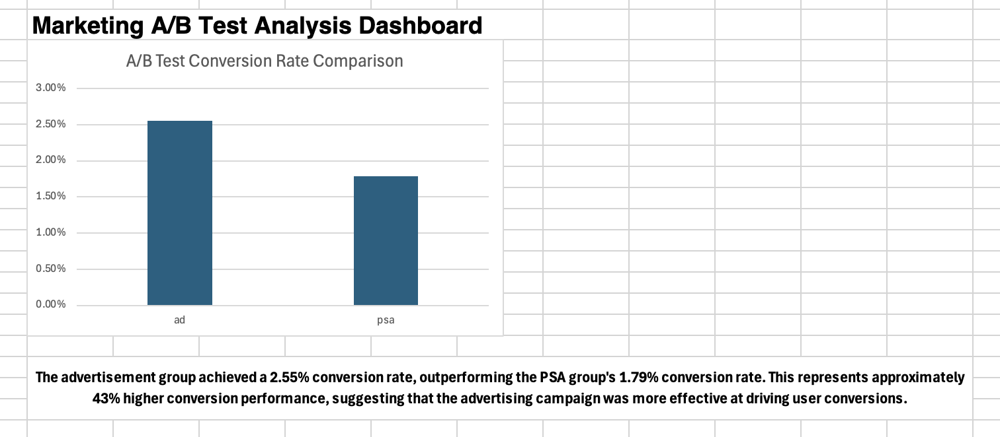

# Marketing A/B Test Analysis

## Overview
This project analyzes a marketing A/B testing dataset containing over 588,000 users. The objective was to compare conversion performance between an advertisement group and a PSA control group.

## Tools Used
- Microsoft Excel
- Pivot Tables
- Data Analysis
- Dashboard Design

## Results

| Group | Users | Conversions | Conversion Rate |
|---------|---------:|---------:|---------:|
| Ad | 564,577 | 14,423 | 2.55% |
| PSA | 23,524 | 420 | 1.79% |

The advertisement group achieved approximately 43% higher conversion performance than the PSA group.

## Dashboard

## Conclusion

The advertisement campaign generated a significantly higher conversion rate than the PSA control group, indicating stronger marketing effectiveness.
